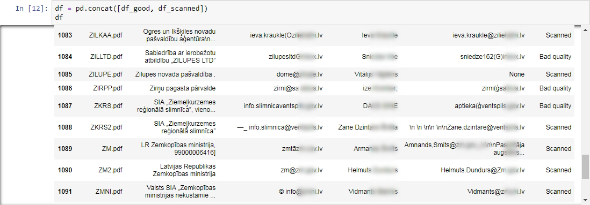
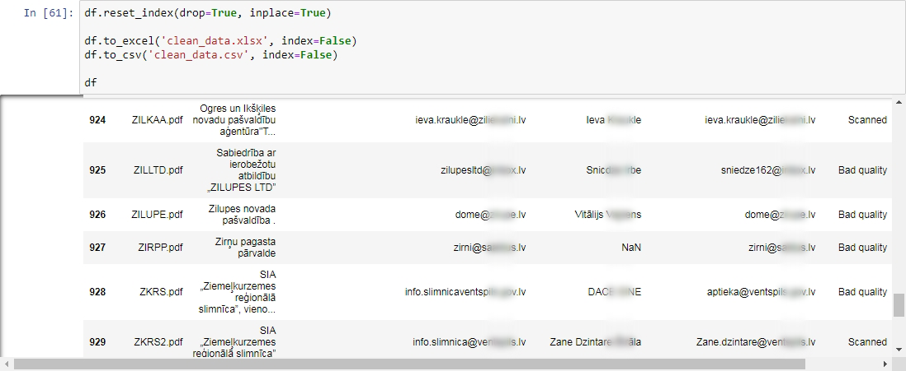
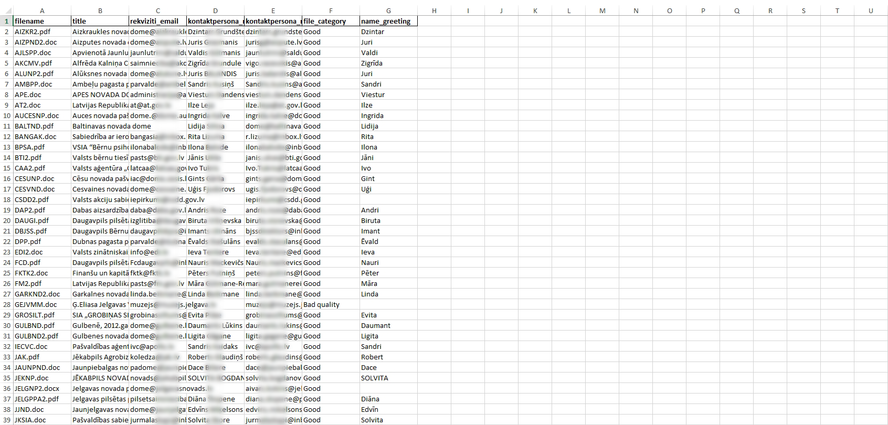

# eProcurement System Data Scraping Project
Importing information from the given website into a spreadsheet

### Job description:

Client provided the web link with a list of ZIP files, each containing an eProcurement system membership registration form (one or two files inside each archive). **The job is to automatically extract the contact data (company name, email address, contact name & email) from as maximum files as possible.**  

*The given link is generally accessible to the interested public. Personal data is subject to the protection requirements set out in The General Data Protection Regulation (GDPR).*

### Complications and challenges:

1. Inconsistency - most commonly there are two different types of registration forms, which use different text fields.

 

2. Data quality - most of the documents (registration forms) are stored in a scanned PDF format. Some having scan quality issues and some even filled in by hand.

 

## The work process:

### Stage 1: Web scraping

Building a web crawler to **download and extract** multiple zipped files from a webpage using Python.

### Stage 2: Extracting and storing data

Building a Python script to extract the desired data (company name, email address, contact name & email) from downloaded files and store it to a DataFrame.

### Stage 3: Data wrangling

Programmatic data cleaning using Python.

## RESULT: File with data ready to use in an email campaign*:
*client is responsible for the campaign to comply with GDPR principles

---

Copyright notice: you may NOT copy and redistribute this material in any medium or format. Personal data is subject to the protection requirements set out in The General Data Protection Regulation (GDPR).

Copyright © 2019 https://git.io/fNK2I ALL RIGHTS RESERVED
